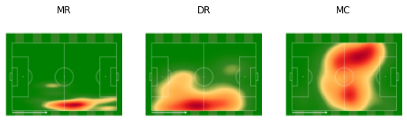
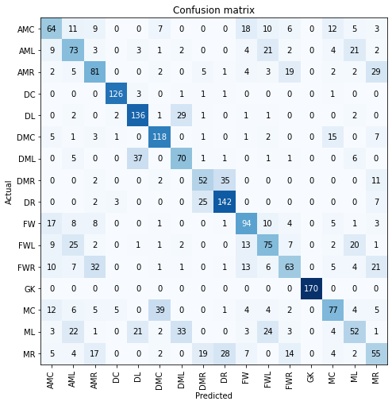

# Predict Players Position
> Summary description here.


## Install

`pip install your_project_name`

## How to use

```python
p=Player_Pos()
```

```python
p.get_data("position_detection")
```

```python
p.check_dls()
```





```python
p.def_model(resnet=resnet18,metric=accuracy);
```

```python
p.tune_model(epoch=3)
```


<table border="1" class="dataframe">
  <thead>
    <tr style="text-align: left;">
      <th>epoch</th>
      <th>train_loss</th>
      <th>valid_loss</th>
      <th>accuracy</th>
      <th>time</th>
    </tr>
  </thead>
  <tbody>
    <tr>
      <td>0</td>
      <td>2.416431</td>
      <td>1.816591</td>
      <td>0.385493</td>
      <td>03:45</td>
    </tr>
  </tbody>
</table>


<table border="1" class="dataframe">
  <thead>
    <tr style="text-align: left;">
      <th>epoch</th>
      <th>train_loss</th>
      <th>valid_loss</th>
      <th>accuracy</th>
      <th>time</th>
    </tr>
  </thead>
  <tbody>
    <tr>
      <td>0</td>
      <td>1.761924</td>
      <td>1.533908</td>
      <td>0.417685</td>
      <td>03:44</td>
    </tr>
    <tr>
      <td>1</td>
      <td>1.560983</td>
      <td>1.492623</td>
      <td>0.423798</td>
      <td>03:41</td>
    </tr>
    <tr>
      <td>2</td>
      <td>1.330911</td>
      <td>1.495518</td>
      <td>0.449878</td>
      <td>03:40</td>
    </tr>
  </tbody>
</table>


```python
p.train_model(epoch=1)
```


<table border="1" class="dataframe">
  <thead>
    <tr style="text-align: left;">
      <th>epoch</th>
      <th>train_loss</th>
      <th>valid_loss</th>
      <th>accuracy</th>
      <th>time</th>
    </tr>
  </thead>
  <tbody>
    <tr>
      <td>0</td>
      <td>1.268402</td>
      <td>1.142709</td>
      <td>0.592471</td>
      <td>04:37</td>
    </tr>
  </tbody>
</table>


```python
p.save_weights(m_name="furGitAfterFixingVFinal")
```

```python
p.load_weights("furGitAfterFixingVFinal")
```

```python
p.Confusion_matrix()
```





```python
p.error_viewer()
```


```python
p.error_solver("position_detection")
```
