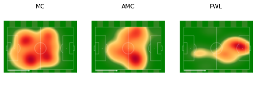

# Predict Players Position
> Used to predict player's position using a heatmap generated using his postion in a given game.


## Install

`pip install Predict_Player_Pos`

## How to use

```python
p=Player_Pos()
```

```python
p.get_data("position_detection")
```

```python
p.check_dls()
```





```python
p.def_model(resnet=resnet18,metric=accuracy);
```

```python
p.tune_model(epoch=2)
```


<table border="1" class="dataframe">
  <thead>
    <tr style="text-align: left;">
      <th>epoch</th>
      <th>train_loss</th>
      <th>valid_loss</th>
      <th>accuracy</th>
      <th>time</th>
    </tr>
  </thead>
  <tbody>
    <tr>
      <td>0</td>
      <td>2.372960</td>
      <td>1.807146</td>
      <td>0.391162</td>
      <td>04:15</td>
    </tr>
  </tbody>
</table>


<table border="1" class="dataframe">
  <thead>
    <tr style="text-align: left;">
      <th>epoch</th>
      <th>train_loss</th>
      <th>valid_loss</th>
      <th>accuracy</th>
      <th>time</th>
    </tr>
  </thead>
  <tbody>
    <tr>
      <td>0</td>
      <td>1.721329</td>
      <td>1.509000</td>
      <td>0.440262</td>
      <td>04:16</td>
    </tr>
    <tr>
      <td>1</td>
      <td>1.466226</td>
      <td>1.467276</td>
      <td>0.452946</td>
      <td>04:36</td>
    </tr>
  </tbody>
</table>


```python
s=p.learn.lr_find()
```


```python
p.train_model(epoch=1,lr=s)
```


<table border="1" class="dataframe">
  <thead>
    <tr style="text-align: left;">
      <th>epoch</th>
      <th>train_loss</th>
      <th>valid_loss</th>
      <th>accuracy</th>
      <th>time</th>
    </tr>
  </thead>
  <tbody>
    <tr>
      <td>0</td>
      <td>1.109406</td>
      <td>0.939968</td>
      <td>0.680779</td>
      <td>03:41</td>
    </tr>
  </tbody>
</table>


```python
p.save_weights(m_name="AiV4")
```

```python
p.load_weights("AiV3")
```

```python
p.Confusion_matrix()
```


```python
p.error_viewer()
```


```python
p.error_solver("position_detection")
```

```python
p.learn.dls=p.dls
```

```python
p.learn.predict()
```

```python
uploader=p.image_importer()
uploader
```

```python
p.learn.predict(PILImage.create(uploader.data[0]))[0]
```


    'FWR'


